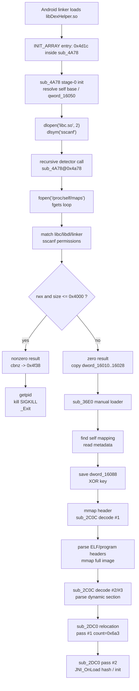
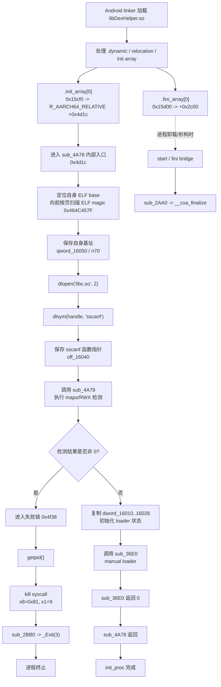
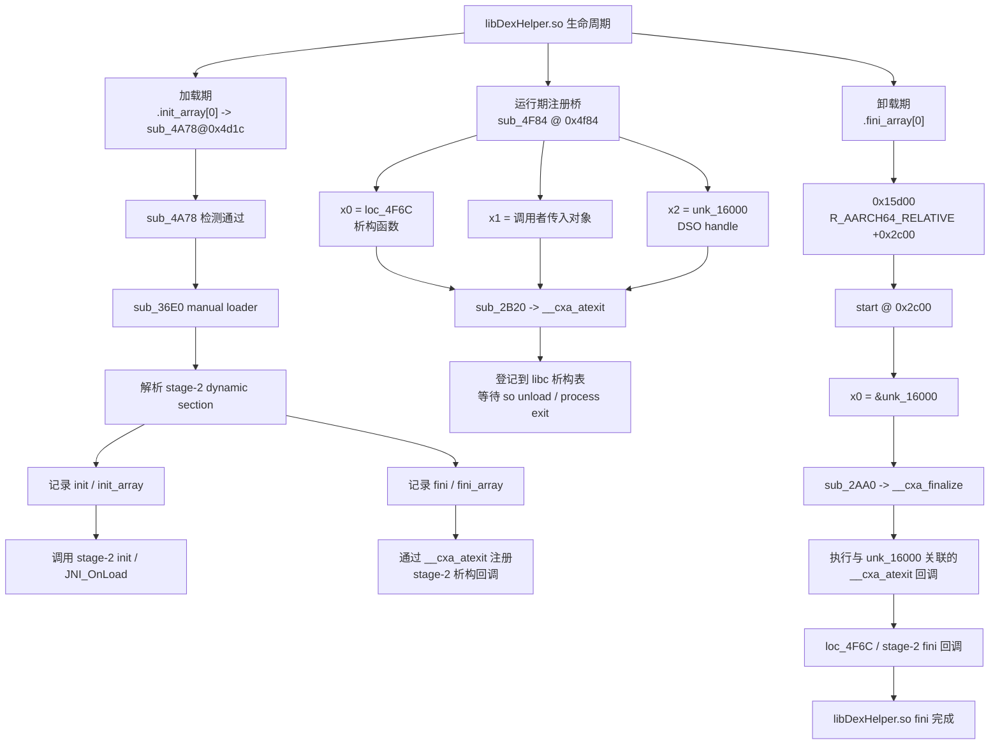
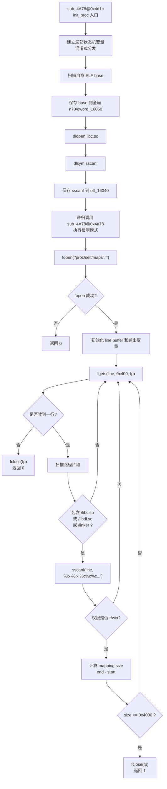
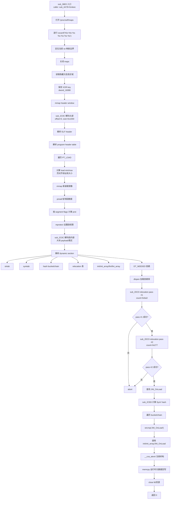
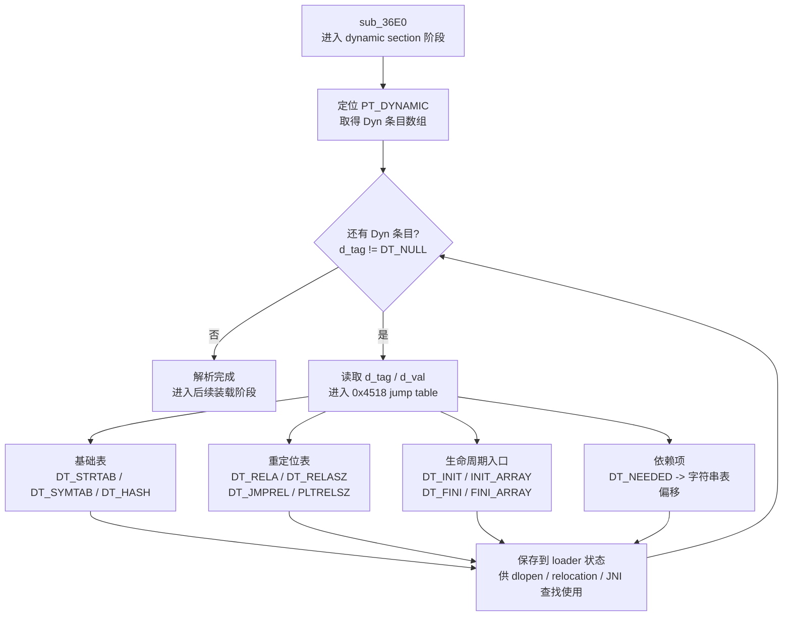
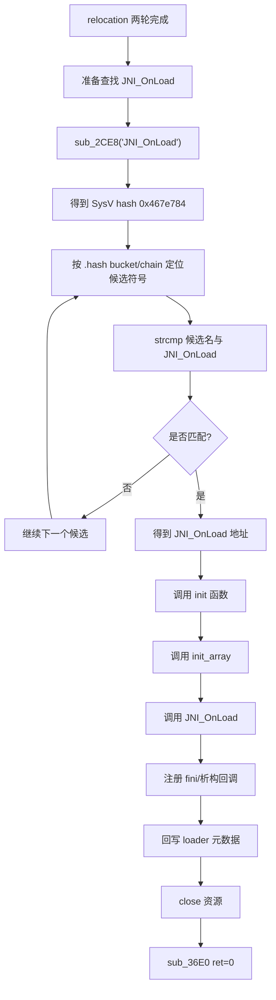
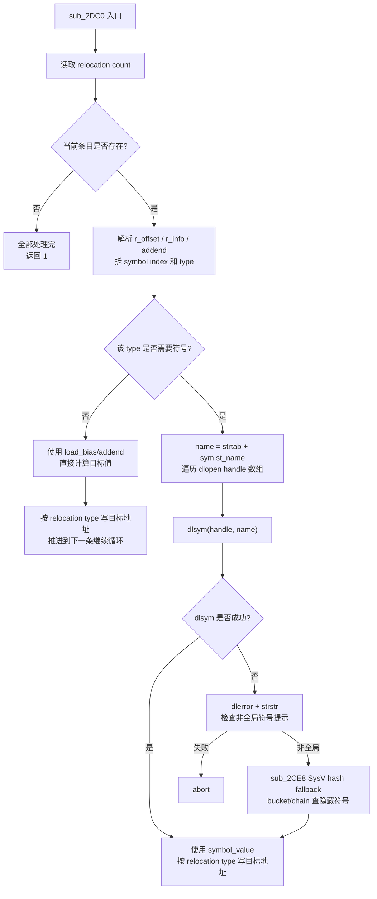
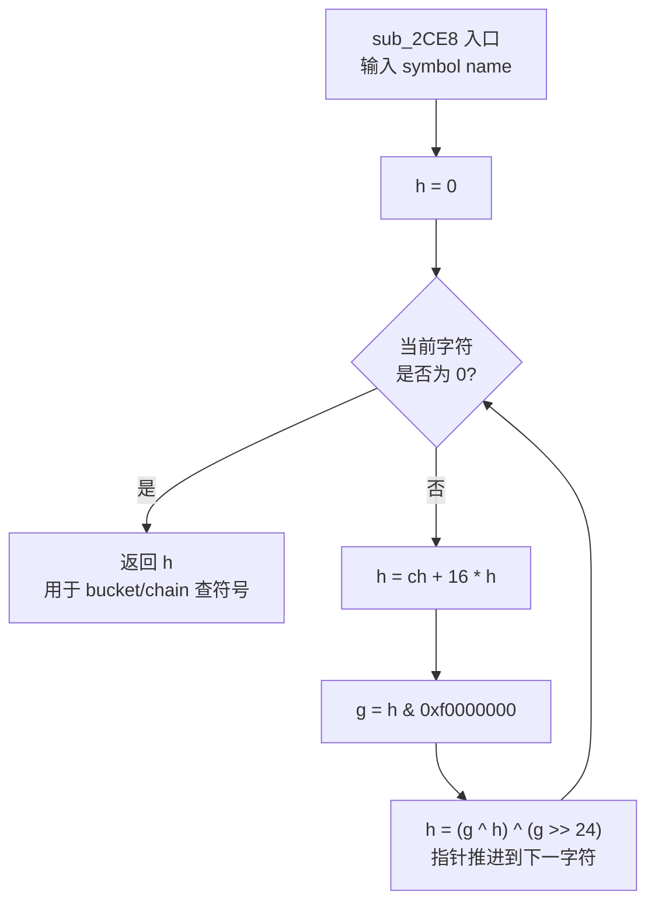
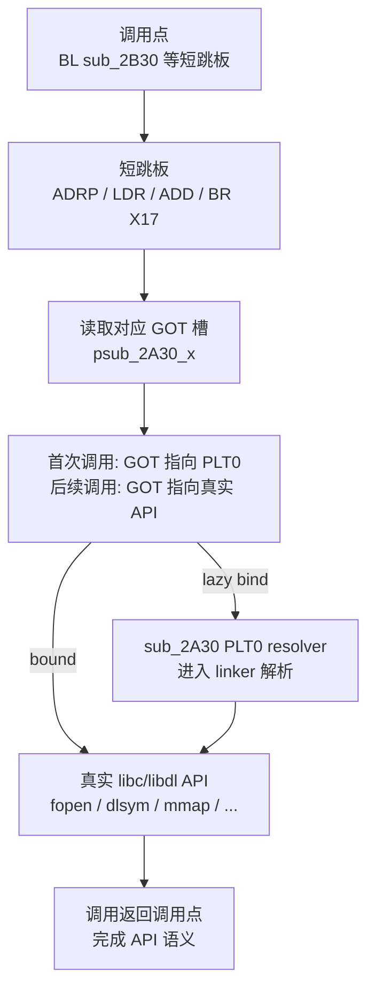

# libDexHelper.so 静态分析

**声明：**

1. 本文仅用于 Android native 加固样本的静态技术研究与学习交流。
2. 本文聚焦 **libDexHelper.so** 的结构、初始化流程、导入跳板、手动 loader 和 relocation 逻辑。
3. 本文只讨论静态结构和函数职责。

## 前言

**libDexHelper.so** 是一个典型加固壳早期 native 组件。它不是普通 JNI 业务库，而是承担初始化门卫、隐藏代码装载、ELF 重定位、**JNI_OnLoad** 调度和析构生命周期管理等职责。

这篇文档按“先看图，再逐函数”的顺序组织:

1. 先用总图建立完整执行路径。
2. 先确认 7 个真实逻辑函数，再把 28 个导入跳板作为支撑层阅读。
3. 再按子流程图拆解关键阶段，完整地址索引放在最后附录。

文中的流程图均以内嵌 Mermaid 保存，图形关系直接存在于 Markdown 正文中，便于发布平台渲染，也便于后续由 AI 或人工继续校订。

建议阅读路线:

1. 先读第 1 章，只抓主干: **sub_4A78 -> sub_36E0 -> sub_2DC0 -> JNI_OnLoad**。
2. 再读第 2 章，把函数按生命周期、门卫链、主 loader、解码、relocation、辅助函数分组。
3. 需要细节时读第 3-8 章；只关心检测面时直接跳到第 10 章。
4. 需要查地址时再看第 11 章附录，不在开头消耗阅读注意力。

## 1. 总图先行

第 1 章只保留两张入口图：一张静态整体调用链，一张 init_proc 总流程。其余子流程图放回对应函数章节，避免开头连续堆图。

### 1.1 静态整体调用链

先只看 5 行主链路:

```text
.init_array[0] -> sub_4A78@0x4d1c
  -> maps 检测
  -> sub_36E0 主 loader
  -> sub_2DC0 relocation
  -> JNI_OnLoad / fini bridge
```

图上真正需要优先记住的是 7 个逻辑函数:

| 地址 | IDA 名称 | 先读作用 |
| --- | --- | --- |
| `0x4a78` | **sub_4A78** | init 门卫、maps 检测、失败终止、进入 loader |
| `0x36e0` | **sub_36E0** | 手动 loader 主体 |
| `0x2dc0` | **sub_2DC0** | relocation 处理器 |
| `0x2c0c` | **sub_2C0C** | XOR 解码 helper |
| `0x2ce8` | **sub_2CE8** | ELF SysV hash helper |
| `0x2c00` | IDA 命名 **start** | 实际是 fini bridge，不是 ELF entry |
| `0x4f84` | **sub_4F84** | **__cxa_atexit** 注册桥 |

28 个 `0x2a30..0x2bf0` 短函数先按 **导入跳板层** 整体理解，完整地址表见第 11 章附录。



读图结论:

- 看什么: 先看 **sub_4A78 -> sub_36E0 -> sub_2DC0 -> JNI_OnLoad** 这条主链。
- 关键判断: 28 个短导入跳板是支撑层，不是逐个展开的主阅读对象。
- 细读位置: 生命周期见第 3 章，门卫链见第 4 章，主 loader 见第 5 章，relocation 见第 6 章。

### 1.2 init_proc 总流程



读图结论:

- 看什么: 从 **.init_array[0]** 到 **sub_36E0** 的初始化主路径。
- 关键判断: **sub_4A78** 的 maps 检测决定进入失败链还是进入主 loader。
- 细读位置: **sub_4A78** 见第 4 章，**sub_36E0** 见第 5 章，fini bridge 见第 3 章。

主流程可以压缩为:

```text
Android linker
  -> .init_array[0]
    -> sub_4A78@0x4d1c
      -> 找自身 ELF base
      -> dlopen("libc.so")
      -> dlsym("sscanf")
      -> 递归进入 sub_4A78@0x4a78
        -> fopen("/proc/self/maps")
        -> fgets maps 行
        -> 匹配 libc.so / libdl.so / linker
        -> sscanf 解析权限
        -> 命中小型 rwx 映射: kill/_Exit 分支
        -> 未命中: sub_36E0 主 loader
          -> 读取隐藏材料
          -> mmap 新镜像
          -> sub_2C0C XOR 解码
          -> 解析 ELF header / program header / dynamic section
          -> dlopen DT_NEEDED
          -> sub_2DC0 relocation
          -> sub_2CE8 + strcmp 查 JNI_OnLoad
          -> init/JNI_OnLoad/析构注册/资源关闭
```

## 2. 从图到函数分组

第 1 章解决“函数在图中的位置”，本章解决“按什么顺序读函数”。后面的第 3-8 章会按这些分组展开，避免把 28 个短导入跳板和 7 个真实逻辑函数混在同一层级阅读。

当前 IDA 函数边界共 35 个函数:

```text
0x2a30..0x2bf0  28 个导入跳板/PLT 封装
0x2c00          IDA 命名 start，实际是 fini bridge
0x2c0c          XOR 解码 helper
0x2ce8          ELF SysV hash helper
0x2dc0          relocation 处理器
0x36e0          主 loader
0x4a78          init 门卫 + maps 检测 + kill 分支
0x4f84          atexit 注册桥
```

按职责可分为 6 组:

| 分组 | 函数 | 说明 |
| --- | --- | --- |
| 生命周期 | IDA 命名 **start**、**sub_4F84**、**sub_2AA0**、**sub_2B20** | fini 触发、析构注册、DSO handle 管理 |
| 门卫链 | **sub_4A78**、**sub_2B10**、**sub_2B30**、**sub_2B40**、**sub_2A80**、**sub_2B60**、**sub_2A70**、**sub_2A60**、**sub_2BB0** | 自定位、maps 扫描、失败终止 |
| 主 loader | **sub_36E0**、**sub_2BD0**、**sub_2B00**、**sub_2AB0**、**sub_2AC0**、**sub_2B50**、**sub_2BA0**、**sub_2BE0**、**sub_2A90**、**sub_2BF0** | 读取、映射、解码、设权限、回写、关闭资源 |
| 解码 | **sub_2C0C** | 单字节 XOR 解码 |
| relocation | **sub_2DC0**、**sub_2B30**、**sub_2A50**、**sub_2AF0**、**sub_2CE8**、**sub_2B80**、**sub_2AD0** | 符号解析、hash fallback、重定位写回、异常终止 |
| 辅助 | **sub_2A30**、**sub_2B70**、**sub_2B90**、**sub_2BC0**、**sub_2AE0** | PLT0、dump 辅助、字符串长度、栈保护失败 |

## 3. 生命周期函数



读图结论:

- 看什么: 析构注册和 **.fini_array** 触发如何闭合。
- 关键判断: IDA 命名 **start** 的 `0x2c00` 实际是 fini bridge，不是 ELF entry。

### 3.1 IDA 命名 **start** - `0x2c00`

这里的 **start** 是 IDA 自动命名，不是 ELF entry，也不是程序启动入口。动态段中的 **.fini_array[0]** 指向 `0x2c00`:

```
0x2c00  adrl x0, unk_16000
0x2c08  b    sub_2AA0
```

**sub_2AA0** 是 **__cxa_finalize** 导入跳板，因此这个函数的实际职责是 fini bridge: 把当前 DSO handle 传给析构收口函数。

### 3.2 **sub_4F84** - `0x4f84`

**sub_4F84** 是析构注册桥:

```
0x4f84  mov  x1, x0
0x4f88  adrp x2, unk_16000
0x4f8c  adrp x0, loc_4F6C
0x4f98  b    sub_2B20
```

它把 `loc_4F6C`、调用者传入对象、`unk_16000` 组织成 **__cxa_atexit(func, arg, dso_handle)** 形式。由此可见:

- **sub_4F84** 是注册侧。
- IDA 命名 **start -> sub_2AA0** 是触发侧。
- **sub_2B20** 和 **sub_2AA0** 分别对应 **__cxa_atexit** 与 **__cxa_finalize**。

## 4. **sub_4A78** 门卫链



读图结论:

- 看什么: **sub_4A78** 的两个入口状态，先初始化 **sscanf**，再进入 maps 检测。
- 关键判断: 是否命中 **libc.so/libdl.so/linker** 的小型 **rwx** 映射。

建议先读 **4.1** 和 **4.2** 建立正常入口与检测态，再读 **4.3** 失败分支，最后用 **4.4** 回到主 loader 入口。

**sub_4A78** 是 **.init_array[0]** 的实际入口承载函数。**.init_array** 重定位指向 **sub_4A78** 内部的 `0x4d1c`，而不是函数起始地址 `0x4a78`。

它包含两个状态:

1. 初始化态: 从 `0x4d1c` 开始，负责自定位和 **sscanf** 解析器准备。
2. 检测态: 从 `0x4a78` 开始，负责扫描 `/proc/self/maps`。

### 4.1 初始化态

初始化态的关键步骤:

1. 按页向前扫描 ELF magic `0x464c457f`，定位当前 so 的内存基址。
2. 将基址写入 `qword_16050/n70`。
3. 调用 **sub_2B10 -> dlopen("libc.so", 2)**。
4. 调用 **sub_2B30 -> dlsym(handle, "sscanf")**。
5. 把 **sscanf** 函数指针保存到 `off_16040`。
6. 递归调用 **sub_4A78@0x4a78**，进入 maps 检测态。

关键反汇编:

```
0x4dd8  adrp x3, n70
0x4ddc  adrp x0, "libc.so"
0x4de0  mov  w1, #2
0x4de8  str  x2, [x3,#n70]
0x4dec  bl   sub_2B10        ; dlopen
0x4df0  adrl x1, "sscanf"
0x4df8  bl   sub_2B30        ; dlsym
0x4e00  str  x0, [off_16040]
0x4e04  bl   sub_4A78        ; enter detector state
```

### 4.2 检测态

检测态的核心逻辑:

```c
fp = fopen("/proc/self/maps", "r");
while (fgets(line, 1024, fp)) {
    if (line_path_contains("libc.so") ||
        line_path_contains("libdl.so") ||
        line_path_contains("linker")) {
        sscanf(line, "%lx-%lx %c%c%c...", &start, &end, &r, &w, &x);
        if (r == 'r' && w == 'w' && x == 'x' && end - start <= 0x4000) {
            return 1;
        }
    }
}
fclose(fp);
return 0;
```

对应导入跳板:

| 函数 | 导入/API | 用途 |
| --- | --- | --- |
| **sub_2B40** | **fopen** | 打开 `/proc/self/maps` |
| **sub_2A80** | **fgets** | 逐行读取 maps |
| `off_16040` | **sscanf** | 解析映射起止地址和权限字符 |
| **sub_2B60** | **fclose** | 关闭 maps 文件句柄 |

这段检测并不是按进程名判断，也不是单纯搜索某个字符串；它关注的是 **libc.so/libdl.so/linker** 相关映射中是否存在小型 **rwx** 区域，大小阈值为 `0x4000`。

### 4.3 失败分支

检测返回值经以下指令进入分支:

```
0x4e04  bl    sub_4A78
0x4e08  uxtb  w0, w0
0x4e0c  cbnz  w0, loc_4F38
```

失败分支:

```
0x4f38  bl    sub_2A70
0x4f3c  sxtw  x0, w0
0x4f40  mov   x1, #9
0x4f44  mov   x8, #0x81
0x4f48  svc   #0
0x4f4c  cmn   x0, #1, lsl #12
0x4f50  mov   x19, x0
0x4f54  b.ls  loc_4F64
0x4f58  bl    sub_2A60
0x4f5c  neg   w19, w19
0x4f60  str   w19, [x0]
0x4f64  mov   w0, #3
0x4f68  bl    sub_2BB0
0x4f74  cbz   x0, loc_4F7C
0x4f78  blr   x0
0x4f7c  ret
```

语义:

- **sub_2A70** 对应 **getpid**。
- `x1 = 9` 是 `SIGKILL`。
- `x8 = 0x81` 是 AArch64 Linux `kill` syscall 号。
- **sub_2A60** 对应 errno 存储位置。
- **sub_2BB0** 对应 **_Exit**，是 syscall 返回后的后备退出路径。

### 4.4 正常分支

检测结果为 0 时，函数继续复制 `dword_16010..16028` 一组状态，并在 `0x4ee8` 调用 **sub_36E0**:

```
0x4ee8  bl    sub_36E0
```

因此 **sub_4A78** 的静态定位是:

```text
init array 入口
  -> 自定位
  -> 初始化 sscanf
  -> maps 小型 rwx 检测
  -> 失败: kill/_Exit
  -> 通过: sub_36E0 主 loader
```

## 5. **sub_36E0** 主 loader



读图结论:

- 看什么: **sub_36E0** 把隐藏材料恢复成可运行镜像的完整 loader 流程。
- 关键判断: 这不是普通 JNI 入口，而是读取、映射、解码、重定位、查找 **JNI_OnLoad** 的装载器。

先按阶段 A-G 读标题，确认 loader 的大方向；再进入每个阶段的代码范围、输入输出和下游函数。dynamic section 和 **JNI_OnLoad** 的细节图放在本章对应小节里。

**sub_36E0** 是 **libDexHelper.so** 的主体函数，大小 `0x1398`。它的职责不是普通 JNI 调用，而是从当前 so 的隐藏材料中恢复后续 ELF/payload，并执行装载器工作。

主线速读:

```text
定位自身映射
  -> 读取隐藏材料和 XOR key
  -> mmap 头部窗口并解码
  -> 遍历 program header，建立完整装载镜像
  -> 解析 dynamic section，收集表地址和依赖项
  -> 两轮 relocation
  -> 查找并调用 JNI_OnLoad，注册析构并收尾
```

本节后面的 A-G 阶段都按同一格式阅读: 先看代码范围，再看行为，最后看关联导入。这样可以把 **sub_36E0** 从一个大函数拆成 7 个连续装载动作。

### 5.1 阶段 A: 定位自身映射

代码范围:

```text
0x3844..0x3910
```

行为:

1. 打开 `/proc/self/maps`。
2. 使用 **sscanf("%lx-%lx %s %s %s %s %s", ...)** 解析每行。
3. 查找包含 `qword_16050` 的映射范围。
4. 关闭 maps 文件。

目的:

- 得到当前 so 的真实加载边界。
- 为后续按文件偏移或映射偏移读取隐藏数据建立基准。

### 5.2 阶段 B: 读取元信息和 XOR key

代码范围:

```text
0x3914..0x39a8
```

行为:

1. 清理工作缓冲。
2. 读取 `0x80000` 级隐藏材料。
3. 从 `qword_16058` 相关区域复制 loader 元信息。
4. 保存 `dword_16088`，作为 **sub_2C0C** 的 XOR key。

关联导入:

| 函数 | API | 用途 |
| --- | --- | --- |
| **sub_2BD0** | **pread** | 早期大块读取 |
| **sub_2B00** | **pread** | 后续片段读取 |
| **sub_2AB0** | **lseek** | 调整 fd 偏移 |
| **sub_2B50** | **memset** | 清理工作缓冲 |

### 5.3 阶段 C: mmap header window 并解码

代码范围:

```text
0x39a8..0x3b8c
```

行为:

1. 通过 **sub_2AC0 -> mmap** 映射一个小窗口。
2. 调用 **sub_2C0C(base, 0, 0x1000)** 解码头部。
3. 解析 ELF header 和 program header。

**sub_2C0C** 的核心语义:

```c
char *sub_2C0C(base, offset, size) {
    p = base + offset;
    for (i = 0; i < size; i++) {
        p[i] ^= dword_16088;
    }
    return p;
}
```

### 5.4 阶段 D: program header 遍历与完整映射

代码范围:

```text
0x3c20..0x43c8
0x4458..0x480c
```

行为:

1. 遍历 `PT_LOAD` 段。
2. 计算页对齐后的目标地址和大小。
3. `mmap` 新的装载镜像。
4. 按 program header flags 计算页面权限。
5. 使用 `mprotect` 修正权限。
6. 调用 `sub_2C0C` 解码大块段内容和表区。

典型解码调用形态:

| 调用位置 | 参数形态 | 说明 |
| --- | --- | --- |
| `0x3a14` | `offset=0`, `size=0x1000` | 解码头部窗口 |
| `0x4550` | `offset=0x40`, `size=0xf6cac` | 解码大块段内容 |
| `0x4350` | `offset=0`, `size=0x9160` | 解码表区或映射片段 |

相关导入:

| 函数 | API | 用途 |
| --- | --- | --- |
| **sub_2AC0** | **mmap** | 创建装载镜像 |
| **sub_2BA0** | **mprotect** | 调整内存权限 |
| **sub_2BE0** | **mprotect** | 按 segment flags 二次设权 |
| **sub_2A90** | **memcpy** | 回写或复制元数据 |

### 5.5 阶段 E: dynamic section 解析



读图结论:

- 看什么: **sub_36E0** 中 `0x4518` jump table 如何把 dynamic tag 分流到 loader 状态。
- 关键判断: 先抓四类输出: 基础表、重定位表、生命周期入口、依赖项。

代码范围:

```text
0x44b0..0x4a1c
```

本阶段的作用是把动态段中的 tag 翻译成 loader 后续可直接使用的状态字段。读这一段时不要把所有 tag 当成同等重要；先抓四类输出即可:

- 基础表: **strtab**、**symtab**、**.hash**。
- 重定位表: 普通 relocation 和 PLT relocation。
- 生命周期入口: init、init_array、fini、fini_array。
- 依赖项: **DT_NEEDED** 字符串偏移。

静态特征:

- `0x4518` 附近存在 dynamic tag jump table。
- 分发约 26 类 dynamic tag。
- 提取 **strtab**、**symtab**、**.hash**、relocation 表、init/init_array、fini/fini_array、**DT_NEEDED** 等字段。

随后 **sub_2B10 -> dlopen** 加载 **DT_NEEDED** 依赖，并保存 handle 数组供 relocation 使用。

### 5.6 阶段 F: 两轮 relocation

**sub_36E0** 调用 **sub_2DC0** 两次:

```text
0x4838 -> sub_2DC0
0x4858 -> sub_2DC0
```

两轮 relocation 对应两个 relocation 表或两类 relocation 记录。**sub_2DC0** 负责遍历条目、解析符号、写回修正地址。

### 5.7 阶段 G: **JNI_OnLoad** 查找与收尾



读图结论:

- 看什么: relocation 完成后如何定位 **JNI_OnLoad** 并完成收尾。
- 关键判断: **JNI_OnLoad** 通过 SysV hash 缩小候选，再用 **strcmp** 确认。

relocation 完成后，loader 继续:

1. 使用 **sub_2CE8** 计算 **"JNI_OnLoad"** 的 ELF SysV hash。
2. 通过 bucket/chain 遍历候选符号。
3. 使用 **sub_2B80 -> strcmp** 确认符号名。
4. 调用 init/init_array/JNI_OnLoad。
5. 使用 **sub_2B20 -> __cxa_atexit** 注册析构。
6. 使用 **sub_2A90 -> memcpy** 回写运行时元数据。
7. 使用 **sub_2BF0 -> close** 关闭 fd/资源。

## 6. **sub_2DC0** relocation 处理器



读图结论:

- 看什么: relocation 条目的遍历、符号解析和目标地址写回。
- 关键判断: **dlsym** 失败后并不立刻终止，特定错误文本会进入 ELF hash fallback。

阅读重点是符号解析链路: 先尝试 **dlsym**，失败后看 **dlerror** 文本，再在特定错误条件下进入 ELF hash fallback。

**sub_2DC0** 大小 `0x4b4`，是手动 loader 完成符号修复的关键函数。

一句话结论: **sub_2DC0** 不是单纯写地址，它同时承担 **找符号** 和 **按 relocation type 写回** 的职责。前者决定 symbol value，后者决定目标位置最终写入什么。

### 6.1 输入语义

按 **sub_36E0** 的调用约定，参数可解释为:

```text
a1: dynsym/symbol table 基址或条目基址
a2: 字符串表/相关基址
a3: relocation 表
a4: relocation 数量
a5: dlopen handle 数组
a6: handle 数量
a7: 新映射基址/load bias
```

### 6.2 核心流程

可以按三层理解:

- 条目层: 遍历 relocation 记录，拆出 offset、info、addend。
- 符号层: 需要符号时先走 **dlsym**，特定失败文本下再走 hash fallback。
- 写回层: 按 relocation type 选择加法、PC 相对修正或 load bias 写入。

```text
for each relocation:
  1. 解析 relocation offset/info/addend
  2. 从 info 拆出 symbol index 和 relocation type
  3. 若 relocation 需要符号:
       name = strtab + sym.st_name
       for handle in dependency_handles:
           addr = dlsym(handle, name)
           if addr found:
               use addr
           else:
               err = dlerror()
               if strstr(err, "symbol found but not global:"):
                   走 ELF hash bucket/chain fallback
  4. 按 relocation type 写目标地址
```

关联函数:

| 函数 | API/语义 | 用途 |
| --- | --- | --- |
| **sub_2B30** | **dlsym** | 从依赖库 handle 查符号 |
| **sub_2A50** | **dlerror** | 读取符号解析错误 |
| **sub_2AF0** | **strstr** | 判断错误是否为非全局符号 |
| **sub_2CE8** | ELF SysV hash | hash fallback |
| **sub_2B80** | **strcmp** | 确认候选符号名 |
| **sub_2AD0** | **abort** | 致命错误出口 |

### 6.3 relocation type 写回规则

已识别写回规则:

```text
257 / 258 / 259: 目标位置 += addend + symbol_value
261 / 262:       目标位置 += addend - target_offset + symbol_value
1024 / 1025:     目标位置 = addend + symbol_value
1026:            目标位置 = addend + symbol_value
1027:            目标位置 = addend + load_bias
```

## 7. **sub_2CE8** ELF SysV hash



读图结论:

- 看什么: **sub_2CE8** 如何逐字符计算 ELF SysV hash。
- 关键判断: 它服务于两个调用点，relocation fallback 和 **JNI_OnLoad** 查找。

**sub_2CE8** 是标准 ELF SysV hash 算法实现:

```c
h = 0;
while (*s) {
    h = *s++ + 16 * h;
    g = h & 0xf0000000;
    h = (g ^ h) ^ (g >> 24);
}
return h;
```

它的阅读价值不在算法本身，而在调用位置。本文中它有两个用途:

1. relocation 期间处理 **dlsym** 不能直接解析的符号。
2. loader 收尾阶段定位 **"JNI_OnLoad"**。

## 8. 导入跳板说明



读图结论:

- 看什么: 调用点、短跳板、GOT 槽、PLT0 resolver、真实 libc/libdl API 的关系。
- 关键判断: `0x2a50..0x2bf0` 大多是导入跳板，不应当和真实逻辑函数同等展开。

`0x2a30..0x2bf0` 是导入跳板区。典型短跳板形态:

```
ADRP X16, #got_slot@PAGE
LDR  X17, [X16,#got_slot@PAGEOFF]
ADD  X16, X16, #got_slot@PAGEOFF
BR   X17
```

**sub_2A30** 是 PLT0 resolver 入口:

```
0x2a30  stp  x16, x30, [sp,#-0x10]!
0x2a34  adrp x16, qword_15F10
0x2a38  ldr  x17, [x16,#qword_15F10]
0x2a3c  add  x16, x16,#qword_15F10
0x2a40  br   x17
```

这一节只需要建立一个判断: `0x2a50..0x2bf0` 这些短函数大多不是业务逻辑，而是到 **libc/libdl** 的导入跳板。逐函数分析时应优先关注谁调用了它、传了什么参数，而不是在跳板内部寻找复杂逻辑。

样本 **.dynsym** 名称被抹空，但文件内保留了导入名字符串池，结合每个跳板的调用点和参数形态可以确定其语义。

## 9. 阅读结论

**libDexHelper.so** 的静态结构可以归纳为:

1. **.init_array[0]** 指向 **sub_4A78** 内部入口 `0x4d1c`，这是启动主入口。
2. **sub_4A78** 先初始化自身上下文和 **sscanf** 指针，再递归进入 maps 检测态。
3. maps 检测关注 **libc.so/libdl.so/linker** 相关小型 **rwx** 映射，命中后走 **kill(getpid(), 9)** 和 **_Exit(3)** 后备退出。
4. 检测未命中时进入 **sub_36E0**，由它完成隐藏 ELF/payload 的读取、映射、解码和 relocation。
5. **sub_2C0C** 是解码原语，**sub_2CE8** 是符号 hash 原语，**sub_2DC0** 是 relocation 原语。
6. **sub_36E0** 后段定位并调用 **JNI_OnLoad**，然后注册析构、回写元数据、关闭资源。
7. **.fini_array[0]** 指向 IDA 命名 **start** 的 fini bridge，配合 **sub_4F84** 形成析构注册与触发闭环。

按函数覆盖范围看，本文已覆盖 **libDexHelper.so** 当前 IDA 函数边界内的全部 35 个函数。

## 10. 检测点汇总

本节只汇总检测面，不重复 loader、relocation 和导入跳板细节。先给出完整链路:

```text
sub_4A78@0x4d1c
  -> 初始化自身基址和 sscanf
  -> sub_4A78@0x4a78
  -> 读取 /proc/self/maps
  -> 筛选 libc.so / libdl.so / linker
  -> 判断小型 rwx 映射
  -> 命中: 0x4e0c -> 0x4f38 -> kill(getpid(), SIGKILL) -> _Exit(3)
  -> 未命中: 0x4ee8 -> sub_36E0
```

### 10.1 入口与对象

**libDexHelper.so** 内真正构成检测逻辑的是 **sub_4A78**。它有两个入口状态:

- `0x4d1c`: **.init_array[0]** 指向的内部入口，负责自身基址定位和 **sscanf** 指针初始化。
- `0x4a78`: 实际检测入口，由 `0x4e04` 递归调用进入，负责扫描 `/proc/self/maps`。

检测对象是 `/proc/self/maps`。执行态通过 **sub_2B40 -> fopen("/proc/self/maps", "r")** 打开 maps，通过 **sub_2A80 -> fgets(line, 0x400, fp)** 逐行读取，再由 **off_16040 -> sscanf** 解析地址范围和权限字段。

这里的关键点是: 它不按进程名判断，也不依赖单一命名字符串；它关心的是内存映射形态。

### 10.2 匹配条件

检测匹配目标集中在三类路径: **libc.so**、**libdl.so**、**linker**。只有当前 maps 行路径匹配这些目标之一时，才继续解析权限字符。

权限格式来自字符串 `%lx-%lx %c%c%c%*c %*s %*s %*d %*s`，对应 start、end、r、w、x 等字段。

核心命中条件是小型 **rwx** 映射:

- 权限字符同时满足 **r == 'r'**、**w == 'w'**、**x == 'x'**。
- 映射长度满足 `end - start <= 0x4000`。

条件命中后 **sub_4A78** 返回 1；遍历结束仍未命中时关闭 maps 并返回 0。

### 10.3 结果消费与失败链

检测结果在 `0x4e08..0x4e0c` 被消费:

```
0x4e04  bl    sub_4A78
0x4e08  uxtb  w0, w0
0x4e0c  cbnz  w0, loc_4F38
```

其中 `0x4e08` 只做返回值规整，`0x4e0c` 才是是否进入失败链的条件跳转。返回值非零时进入 `0x4f38`；返回值为 0 时继续正常初始化，并在 `0x4ee8` 调用 **sub_36E0**。

失败链从 `0x4f38` 开始。**sub_2A70 -> getpid** 取得当前进程 pid，随后设置 `x1 = 9`、`x8 = 0x81` 并在 `0x4f48` 执行 **svc #0**。在 AArch64 Linux syscall 约定下，这就是 **kill(getpid(), SIGKILL)**。

如果 syscall 返回，后续还有一条后备退出链。**sub_2A60** 用于处理 errno 存储位置，随后 `mov w0, #3; bl sub_2BB0` 进入 **_Exit(3)** 风格退出。这个结构说明检测命中后的终止路径不是单点，而是 **kill** 加 **_Exit** 的双保险。

### 10.4 非主动检测出口

**sub_2AD0 -> abort** 是 relocation 处理器 **sub_2DC0** 的致命错误出口，不属于 maps 检测点。它在符号解析、relocation 类型或写回过程遇到不可恢复状态时终止流程。

**sub_2AE0 -> __stack_chk_fail** 是编译器栈保护失败出口，也不属于壳的主动 maps 检测点。它用于函数栈 canary 异常时的通用保护收口。

因此，本库可确认的主动检测面只有一条主线: **sub_4A78** 读取 `/proc/self/maps`，筛选 **libc.so/libdl.so/linker**，判断小型 **rwx** 映射，非零结果经 `0x4e0c` 转入 `0x4f38` 失败链。**abort** 和 **__stack_chk_fail** 是错误/保护出口，应在分析中单独归类。

## 11. 附录: 全函数地址索引

本附录只用于查地址，不作为首次阅读入口。正文先读 7 个真实逻辑函数，28 个导入跳板按支撑层整体理解。

### 11.1 真实逻辑函数

| 地址 | IDA 名称 | 大小 | 归属图层 | 作用 |
| --- | --- | ---: | --- | --- |
| `0x2c00` | IDA 命名 **start** | `0x0c` | fini 生命周期 | 实际是 fini bridge，调用 **__cxa_finalize(dso_handle)** |
| `0x2c0c` | **sub_2C0C** | `0xdc` | 解码图 | 单字节 XOR 解码 helper |
| `0x2ce8` | **sub_2CE8** | `0xd8` | relocation/JNI 图 | ELF SysV hash helper |
| `0x2dc0` | **sub_2DC0** | `0x4b4` | relocation 图 | relocation 处理器 |
| `0x36e0` | **sub_36E0** | `0x1398` | 主 loader 图 | 手动 loader 主体 |
| `0x4a78` | **sub_4A78** | `0x50c` | init 门卫图 | 自定位、maps 检测、失败终止和进入 loader |
| `0x4f84` | **sub_4F84** | `0x18` | fini 生命周期 | **__cxa_atexit** 注册桥 |

### 11.2 导入跳板与辅助出口

| 地址 | IDA 名称 | 大小 | 归属图层 | 作用 |
| --- | --- | ---: | --- | --- |
| `0x2a30` | **sub_2A30** | `0x14` | 导入跳板区 | PLT0 resolver 入口，所有导入跳板最终经它或相邻 GOT 槽跳转 |
| `0x2a50` | **sub_2A50** | `0x10` | relocation 图 | **dlerror**，在 **dlsym** 后读取错误信息 |
| `0x2a60` | **sub_2A60** | `0x10` | **sub_4A78** 失败链 | errno 存储位置，处理失败 syscall 返回 |
| `0x2a70` | **sub_2A70** | `0x10` | **sub_4A78** 失败链 | **getpid**，给 kill syscall 提供 pid |
| `0x2a80` | **sub_2A80** | `0x10` | maps 读取链 | **fgets**，逐行读取 `/proc/self/maps` |
| `0x2a90` | **sub_2A90** | `0x10` | **sub_36E0** 收尾 | **memcpy**，复制/回写运行时元数据 |
| `0x2aa0` | **sub_2AA0** | `0x10` | fini 生命周期 | **__cxa_finalize**，析构收口 |
| `0x2ab0` | **sub_2AB0** | `0x10` | **sub_36E0** loader | **lseek**，调整 fd 偏移 |
| `0x2ac0` | **sub_2AC0** | `0x10` | **sub_36E0** loader | **mmap**，映射 header window 和完整装载镜像 |
| `0x2ad0` | **sub_2AD0** | `0x10` | relocation 图 | **abort**，relocation 致命错误出口 |
| `0x2ae0` | **sub_2AE0** | `0x10` | 辅助/保护 | **__stack_chk_fail**，栈保护失败出口 |
| `0x2af0` | **sub_2AF0** | `0x10` | relocation 图 | **strstr**，判断 **dlerror** 是否含非全局符号提示 |
| `0x2b00` | **sub_2B00** | `0x10` | **sub_36E0** loader | **pread**，读取隐藏材料或 segment 数据 |
| `0x2b10` | **sub_2B10** | `0x10` | init/loader 依赖链 | **dlopen**，打开 libc 和 DT_NEEDED 依赖 |
| `0x2b20` | **sub_2B20** | `0x10` | fini 生命周期 | **__cxa_atexit**，注册析构回调 |
| `0x2b30` | **sub_2B30** | `0x10` | init/relocation 图 | **dlsym**，解析 **sscanf** 和依赖符号 |
| `0x2b40` | **sub_2B40** | `0x10` | maps 读取链 | **fopen**，打开 `/proc/self/maps` |
| `0x2b50` | **sub_2B50** | `0x10` | **sub_36E0** loader | **memset**，清理工作缓冲 |
| `0x2b60` | **sub_2B60** | `0x10` | maps 读取链 | **fclose**，关闭 maps 文件句柄 |
| `0x2b70` | **sub_2B70** | `0x10` | dump 辅助 | **isprint**，判断可打印字符 |
| `0x2b80` | **sub_2B80** | `0x10` | relocation/JNI 图 | **strcmp**，确认符号名 |
| `0x2b90` | **sub_2B90** | `0x10` | dump 辅助 | **sprintf**，格式化十六进制 dump 行 |
| `0x2ba0` | **sub_2BA0** | `0x10` | **sub_36E0** loader | **mprotect**，调整装载镜像权限 |
| `0x2bb0` | **sub_2BB0** | `0x10` | **sub_4A78** 失败链 | **_Exit**，kill 后备退出 |
| `0x2bc0` | **sub_2BC0** | `0x10` | dump 辅助 | **strlen**，取格式化字符串长度 |
| `0x2bd0` | **sub_2BD0** | `0x10` | **sub_36E0** loader | **pread**，早期读取 `0x80000` 级隐藏材料 |
| `0x2be0` | **sub_2BE0** | `0x10` | **sub_36E0** loader | **mprotect**，按 program header flags 设置页面保护 |
| `0x2bf0` | **sub_2BF0** | `0x10` | **sub_36E0** 收尾 | **close**，关闭 fd/资源 |


